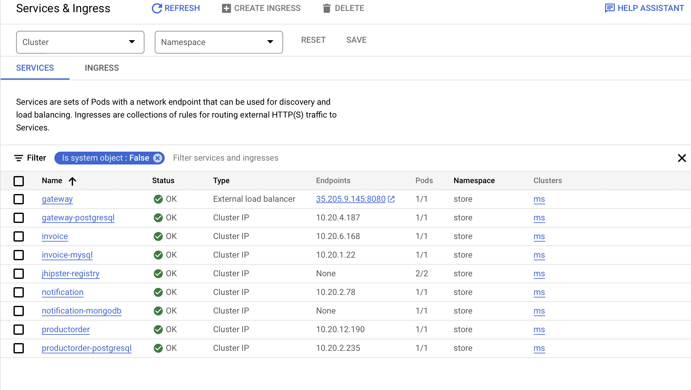

# MicroServices with JHipster and GCP
### By Younes BELGRID (@fimtow) younes.belgrid@grenoble-inp.org and Oussama TCHAH (@TchahOussama) oussama.tchah@grenoble-inp.org

## Deployment of Microservices with JHipster on GCP

After deploying the microservices on GCP. We can see the pods and services using kubectl or directly from the GCP console.

## Enabling scalability on GCP for one microservice 

We can increment the number of replicas for a certain service.

## Monitoring dashboard

The grafana dashboard that comes with the deployment doesn't really contain any info.

Instead we used a grafana dashboard we found on the internet. We deployed it in the cluster in a new namespace.

We can also see monitoring info directly from the GCP console.

## Load injection with Gatling for demonstrating scalability

We first enabled autoscaling on the gateway.

Then we ran gatling on the gateway. New replicas are created to handle the increasing number of requests (Up to 4 as we have set it in the autoscaling). Each peak on the CPU and memory usage corresponds to a run of gatling.

The report of the last run is as follow (Last peak on the grafana dashboard).

